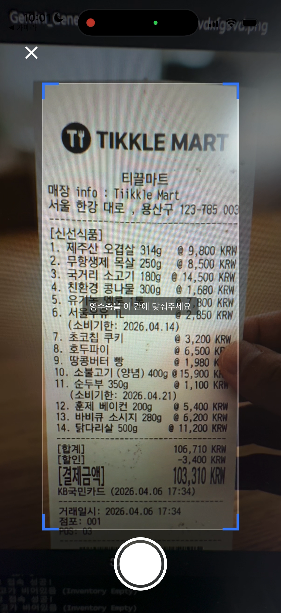
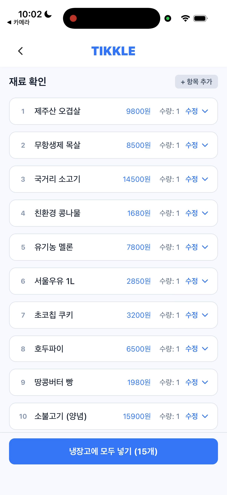
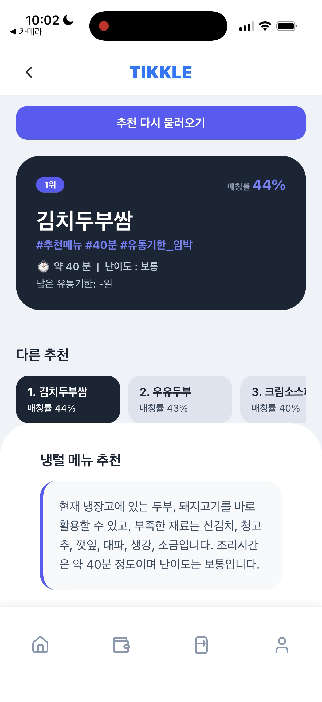
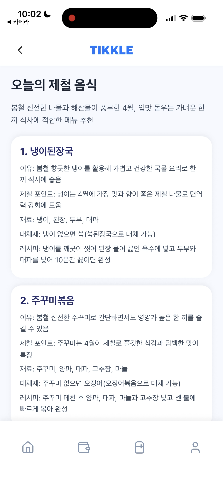
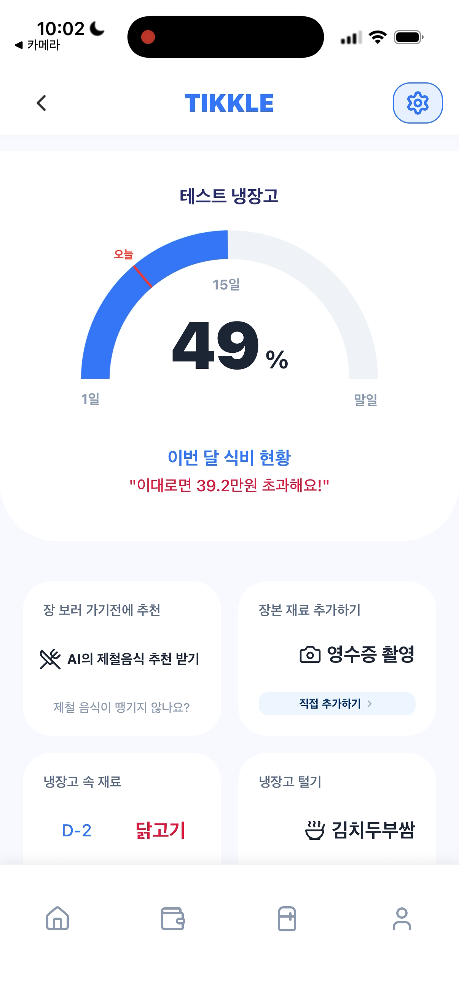
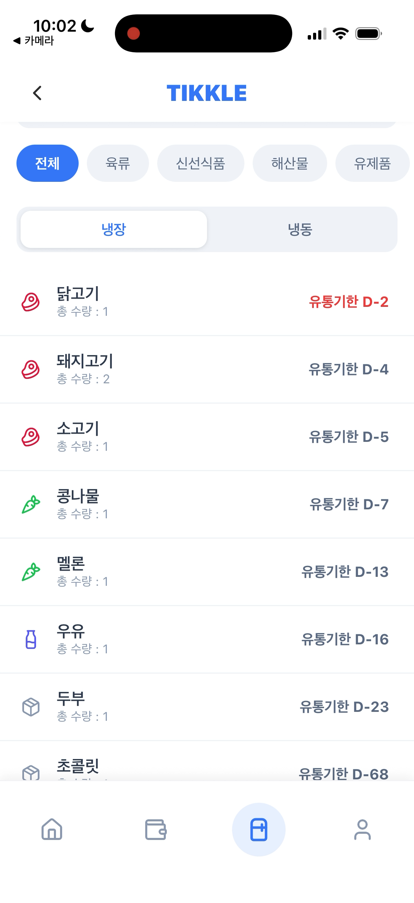
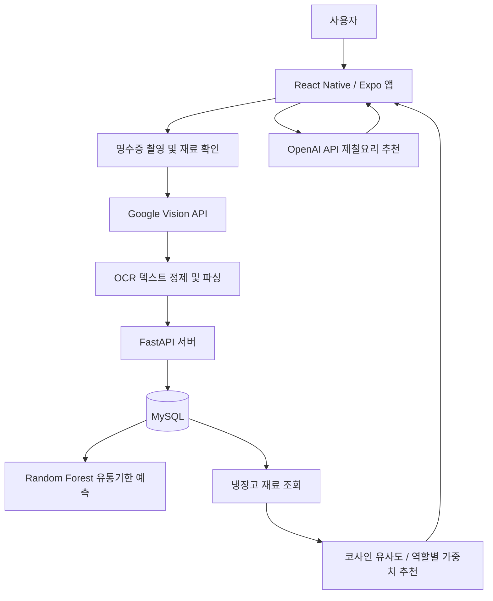

# Tikkle (식비 절약 및 냉장고 관리 서비스)

> **OCR 기반 영수증 인식**을 통해 식재료 구매 내역을 자동 등록하고, **ML 기반 소비기한 예측 모델**과 **레시피 추천 알고리즘**을 결합하여 식재료 낭비를 줄이고 합리적인 식비 관리를 지원하는 냉장고·식비 통합 관리 서비스입니다.

- **개발 기간**: 2026.03 ~ 2026.04 (4주 / 팀 프로젝트)
- **참여 인원**: 4명
- **담당 역할**: 팀원 / 냉장고 도메인 데이터 파이프라인, OCR 정제 화면, ML 예측 모델, 레시피 추천 알고리즘, OpenAI API 추천 기능 구현
---

## 담당 역할

냉장고 도메인에서는 OCR, ML 예측 모델, 추천 알고리즘, 생성형 AI를 결합한 데이터 기반 식재료 관리 및 레시피 추천 흐름을 구현했습니다.

공공데이터포털 레시피 데이터를 수집·정제하고, 재료명·용량·조리정보를 추천 엔진에서 활용 가능한 구조로 정규화했습니다. 또한 Google Vision API 기반 영수증 OCR 결과를 후처리하여 상품명과 수량 정보를 추출하고, 사용자가 검수 후 냉장고 재료로 저장할 수 있는 데이터 입력 흐름을 구현했습니다.

유통기한 예측에는 식품분류, 품목명, 보관조건을 feature로 사용한 Random Forest 모델을 적용했습니다. 학습 데이터에 없는 신규 품목은 식품군 및 품목명 유사도 기반 폴백 로직으로 가장 가까운 참조 품목을 탐색해 예측 안정성을 보완했습니다.

레시피 추천에는 보유 식재료와 레시피 재료 간 코사인 유사도를 활용했습니다. 여기에 주재료, 부재료, 양념의 역할별 가중치를 추가해 단순 일치 개수 기반 추천이 아니라 실제 조리 가능성과 재료 소진 효율을 함께 고려한 매칭 스코어 기반 추천 라우터를 구현했습니다.

추가로 OpenAI API를 연동해 보유 재료와 계절성을 고려한 식비 절약형 제철요리 추천 기능을 구현했으며, JSON Schema 기반 응답 형식을 적용해 생성형 AI 결과를 안정적으로 파싱하고 서비스 데이터로 활용할 수 있도록 구성했습니다.

### 구현 화면 및 분석 자료

<p align="center">
  
  
  
  
</p>

<p align="center">
  
  
</p>

<p align="center">
  
  
</p>

---

## Tech Stacks

- **Language**: Python, JavaScript
- **Frontend**: React Native, Expo, React Navigation, Axios
- **Backend**: FastAPI, SQLAlchemy, Pydantic
- **Database**: MySQL
- **ML & Data Analysis**: Scikit-learn, Pandas, RapidFuzz, joblib
- **AI API**: Google Cloud Vision API, OpenAI API
- **PM & Collab Tools**: VS Code, Docker, Slack, Git, Notion

---

## 협업 및 생산성 툴


- **GitHub & Git-flow**: 코드 버전 관리 및 `main` - `develop` - `feature` 중심의 브랜치 전략 운영
- **Notion & Slack**: API 명세서, 칸반 보드 진척도 관리 및 실시간 소통, GitHub 알림 연동
- **Figma**: 유저 플로우 및 와이어프레임 설계, 개발 착수 전 UI/UX 컴포넌트 사전 합의

---

## Key Features & Architecture

### 1. OCR 기반 데이터 자동 파싱 및 식비 시각화

- **Google Vision API**를 활용하여 영수증 이미지 내 품목명, 수량, 결제 금액 등 핵심 텍스트를 파싱하는 로직을 설계했습니다.
- `국산 우리 콩두부 100g`과 같은 복잡한 상품명 노이즈를 `두부`와 같은 대표 키워드로 정제 및 정규화하여 인벤토리 DB에 저장할 수 있도록 구성했습니다.
- 영수증 총액을 분석해 사전에 설정된 식비 예산에서 차감하고, 대시보드의 반원형 게이지 차트에 반영하여 사용자의 지출 페이스 조절을 유도했습니다.

<p align="center">
  
  
  
</p>

### 2. Random Forest 기반 유통기한 예측 파이프라인

- 식품분류, 품목명, 보관조건 메타데이터를 `LabelEncoder`로 수치화하여 **Random Forest Regressor** 기반 유통기한 예측 모델을 구축했습니다.
- 학습되지 않은 신규 품목이 들어올 경우 `RapidFuzz`를 활용해 유사 품목을 탐색하고, 일정 유사도 이상인 품목의 예측치를 차용하는 폴백 로직을 설계했습니다.
- 카테고리별 안전 가중치를 적용해 신선식품, 육류, 해산물, 유제품 등 변질 위험이 큰 품목은 유통기한을 보수적으로 저장하도록 설계했습니다.

### 3. 도메인 지식 기반 레시피 추천 알고리즘

#### 이론적 구현: 코사인 유사도 기반 CBF 모델

- 사용자 보유 재고 상태와 레시피 메타데이터를 동일 벡터 공간에 정렬한 뒤, Scikit-learn 기반 코사인 유사도를 계산했습니다.
- 기한 임박 재료가 상위에 노출될 수 있도록 D-Day 기반 우선순위 가중치를 설계했습니다.
- 추천 큐를 `유통기한 임박 순 -> 유사도 높은 순 -> 일치 재료 많은 순 -> 누락 재료 적은 순` 기준으로 정렬하는 구조를 설계했습니다.

```text
Urgency Weight = 10 / (D-Day + 1)
Final Score = (Cosine Similarity * 0.8) + (Urgency Score / 10 * 0.2)
```

#### 실서비스 API 적용: 식재료 역할별 가중치 모델

- 실제 API에는 조리 도메인 지식을 반영하여 식재료의 핵심도에 따라 차등 배점하는 추천 라우터를 연동했습니다.
- 주재료 3.0점, 부재료 1.5점, 양념 0.5점 기준으로 매칭 점수를 계산하여, 실제 조리에 중요한 재료가 더 많이 반영되도록 구성했습니다.

<p align="center">
  
  
</p>

### 4. OpenAI API 기반 원터치 제철음식 추천

- 기존 챗봇처럼 사용자가 반복적으로 질문해야 하는 방식이 아니라, 한 번의 클릭으로 현재 계절에 맞는 메뉴를 추천받는 원터치 UX를 구현했습니다.
- 월별 제철 식재료 힌트와 사용자의 보유 재료를 함께 전달하여 식비 절약에 적합한 현실적인 메뉴를 추천하도록 프롬프트를 설계했습니다.
- 토큰 비용 효율화 및 후처리 안정성을 위해 `max_output_tokens=700`을 설정하고, JSON Schema 기반 응답 형식으로 메뉴명, 추천 이유, 제철 포인트, 재료, 대체재, 간단 조리법을 반환하도록 제한했습니다.

<p align="center">
  
</p>

---

## Data Engineering & Validation

### 데이터 수집 및 정제 파이프라인

- Pandas를 활용해 공공데이터포털 기반 레시피 원천 데이터에서 불필요한 메타데이터 컬럼을 제거하고, 서비스 추천 엔진에 필요한 컬럼 중심으로 재구성했습니다.
- `60분 이내`, `2시간 이상`과 같은 비정형 조리시간 데이터를 분 단위 정수형으로 정규화했습니다.
- 문장 형태로 혼재된 재료 설명을 주재료, 부재료, 양념의 3가지 속성으로 분리하고, 특수문자 및 공백 노이즈를 제어했습니다.

### 데이터 탐색적 분석을 통한 타당성 검증

- 수집·정제된 레시피 데이터의 조리시간 분포를 분석해 일상 조리 구간에 적합한 데이터인지 확인했습니다.
- 난이도 분포를 함께 확인하여 추천된 레시피가 실제 사용자의 일상에서 바로 실행 가능한지 검토했습니다.

### MySQL RDBMS 적재 및 쿼리 최적화

- 정제된 마스터 데이터를 관계형 DB 구조에 맞게 적재하기 위해 레시피, 재료, 냉장고 도메인 스키마를 설계했습니다.
- `JOIN`, `WHERE`, `GROUP BY`, `ORDER BY`를 활용해 카테고리별 조회와 유사도·날짜 기준 다중 정렬이 가능하도록 구성했습니다.

---

## System Flow



---

## Folder Structure

```text
MBCA_TeamProjects
├─ backend
│  └─ app
│     ├─ api/fridge            # 냉장고, OCR, 추천 API
│     ├─ core/ocr              # Google Vision OCR 및 파싱
│     ├─ core/recommend        # 레시피 추천 로직
│     ├─ ml/fridge             # 추천 엔진 및 유통기한 모델 데이터
│     └─ models/fridge         # 냉장고 도메인 DB 모델
├─ frontend
│  └─ src/domains/fridge       # 냉장고 화면, OCR 확인, 추천 화면
├─ Images                      # README 시연 이미지
└─ docker-compose.yml
```

---

## 실행 방법

### Backend

```bash
docker compose up --build
```

### Frontend

```bash
cd frontend
npm install
npm run start
```

---

## 회고 및 개선 방향

- 현재 실서비스 API에 적용된 엔진은 식재료 역할별 가중치 배점 방식을 중심으로 동작하므로, 시계열 수치인 유통기한 임박도를 더 정밀하게 결합하는 고도화 여지가 있습니다.
- 향후에는 D-Day 가중치 필터를 추천 라우터에 직접 결합하거나, 코사인 유사도 기반 CBF 모듈을 실서비스 라우터와 통합하여 추천 품질을 개선할 계획입니다.
